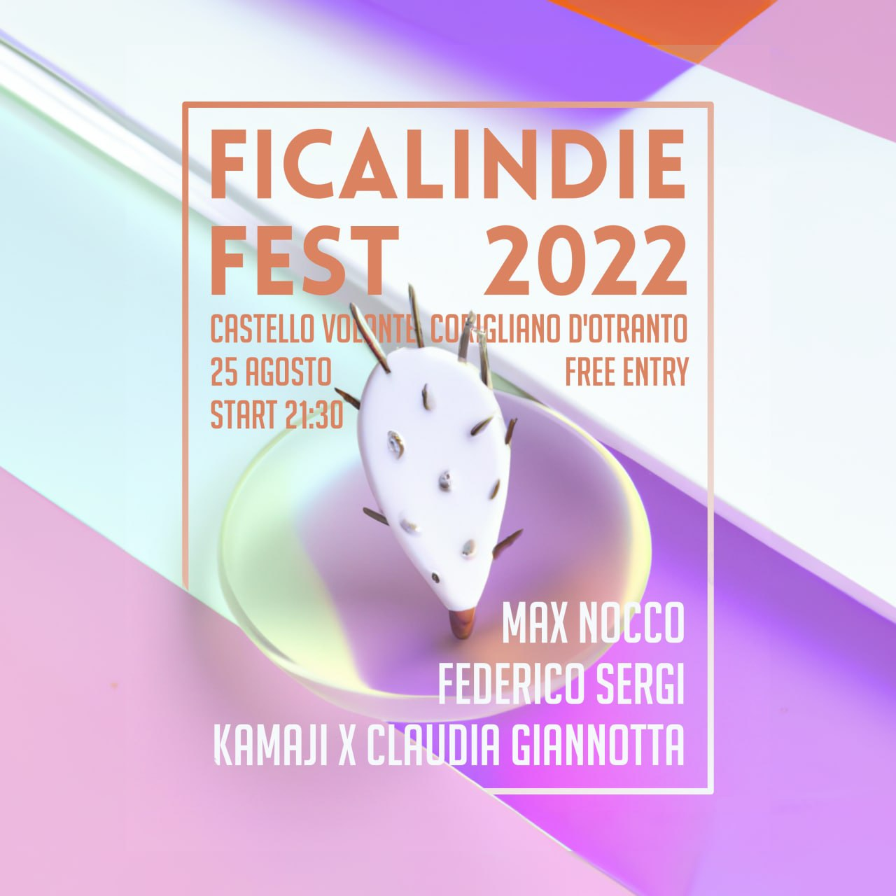
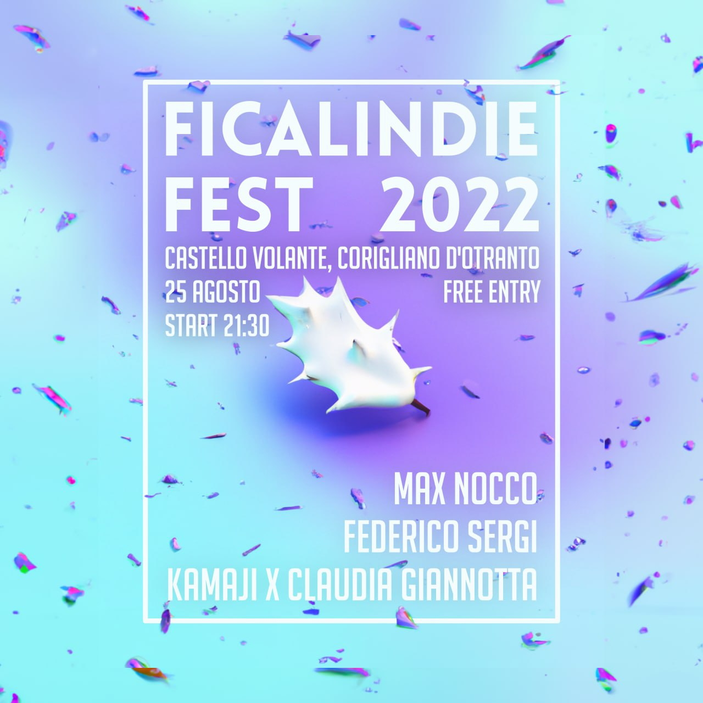
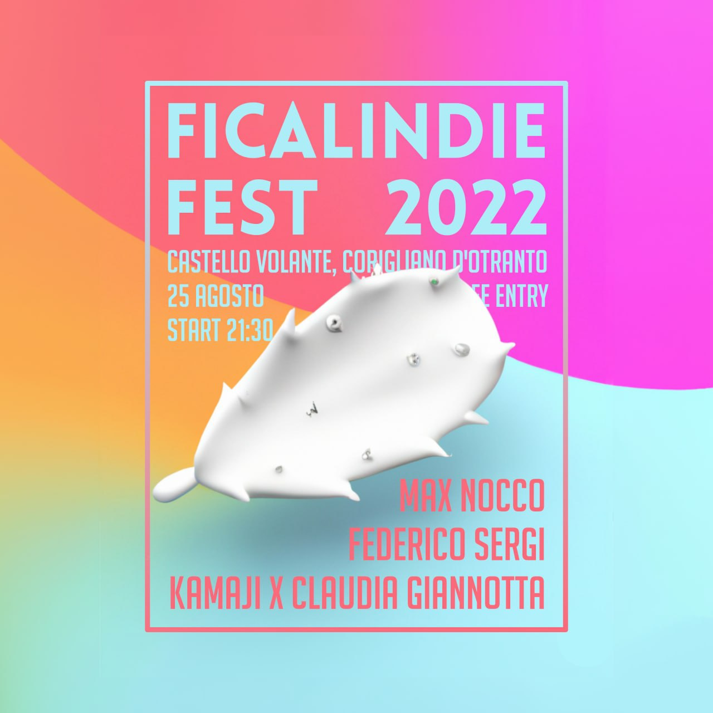
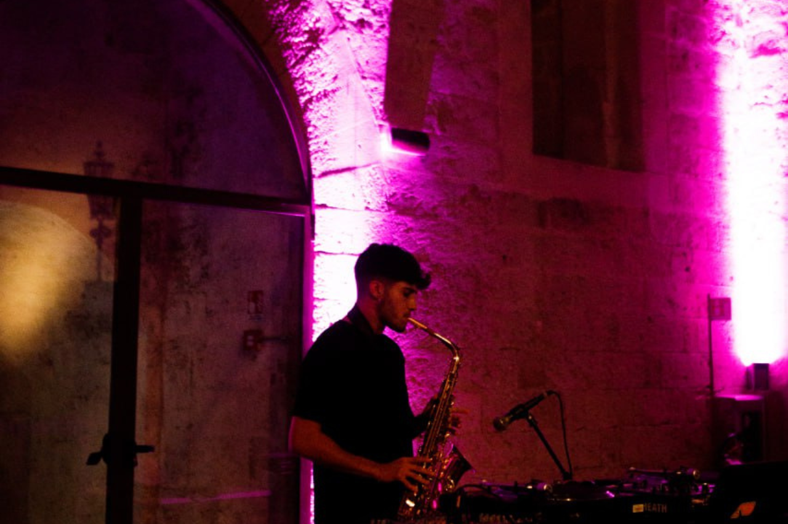
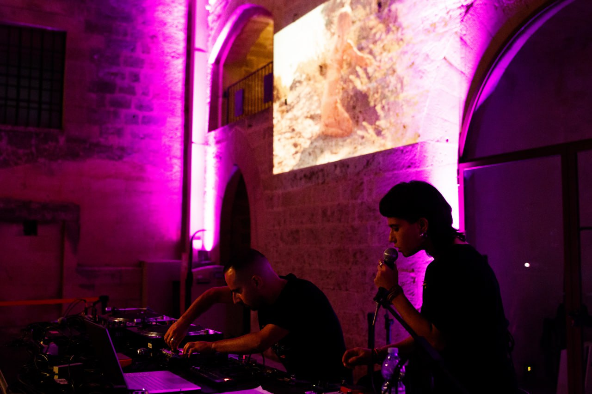
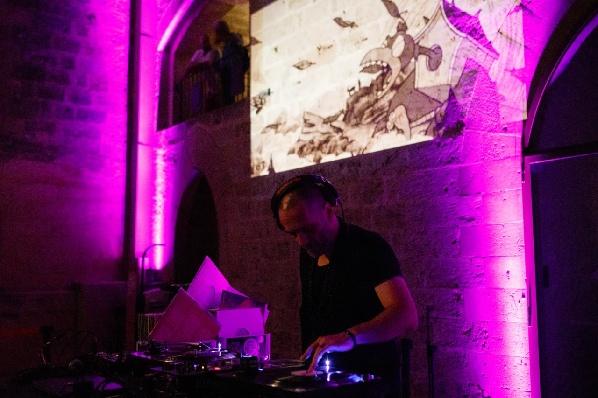
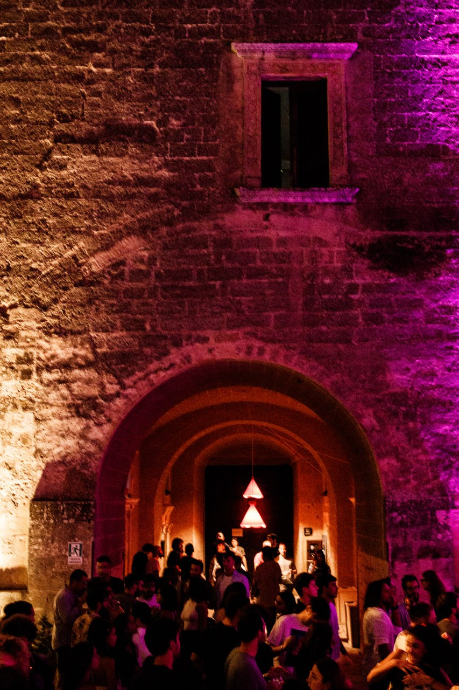

<p align="center">
  
  # Welcome to Ficalindie's repo!
  <a href="https://www.instagram.com/ficalindie/">
    
  </a>
  <a href="mailto:ficalindiefest@gmail.com">
    
  </a>
  
</p>
  <p align="center">
    
  </p>
  
  _A first nerdy attempt to present our side work during these years_
  
  What will you find here?
  * ❓ who we are
  * 📸 photo history
  * 👕 online shop
  * 💻 funny repos
  
  ## 🌵 About us
  We are a group of five young people from [Corigliano d'Otranto](https://www.hdsalento.com/corigliano-dotranto/), 
  who have already achieved considerable success with the previous edition of the "Ficalindie Fest 2022" event last year, 
  attracting more than 300 people to the suggestive [Castello De' Monti](https://www.beniculturalionline.it/location-4663_Castello-De%E2%80%99-Monti-.php).
  
  Our vision for this unique event is to create an immersive and immersive experience, where AI-generated art merges with the creativity and expressiveness of the musicians who will be performing live. 
  Through this interaction between technology and human talent, we intend to offer the public a unique perspective on the connection between traditional art and the new digital frontiers.
  
  **_Mpunna moi._**
  
  
  ## 🌆 2022 Edition pics
  Our AI-enhanced 2022 poster:
  <p align="center">
    
     
    
  </p>
  
  Our 2022 amazing artists:
  <p align="center">
    
     
    
  </p>
  
  Our incredible location:
  <p align="center">
    

  ## 🤖 Funny repos 
  * [Customisable PC screensaver](https://github.com/ficalindie/ficalindie_screensaver/tree/main), ficalindie branded 😎
  * [ChatCuddhi](https://github.com/ficalindie/ChatCuddhi), a very first attempt in creating a dumb chatbot able to translate from griko (ancient Salento's dialect) to italian.

  
  ## 🛒 Shop (GOOD STUFF)
  * T-shirtz
  * Posterz
  * Stickerz
  * ↪️ [Here!](http://ficalindie.bigcartel.com)

  ## 🌇 La Genesi
  [You know](https://www.youtube.com/watch?v=VrIq0mzVn98&ab_channel=Salento420)

-----------------------------------------------------
```python
    assert tutti_li_beddhi_carusi in Salento
    
    for nu_cristianu in tutti_li_beddhi_carusi:
      life_points[nu_cristianu] += 1
      log.write('Mpunna moi')
```
<p align="center">
    
  </p>
